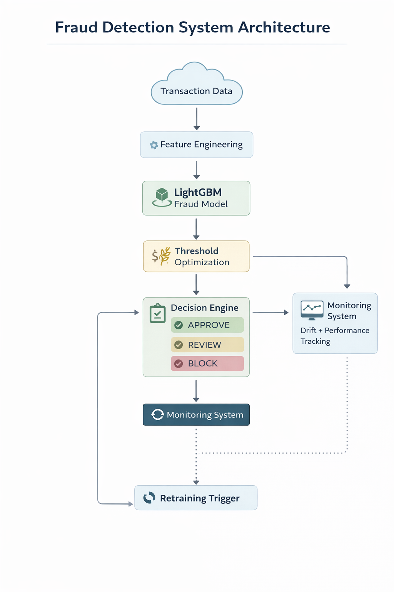

Drift-Aware Utility-Optimized Credit Card Fraud Detection System
Project Overview

This project implements a realistic bank-grade fraud detection system designed to balance fraud detection performance with customer experience and business cost constraints.

Traditional fraud detection projects often focus only on model accuracy. This project simulates how financial institutions deploy and maintain fraud detection systems in production by integrating:

Predictive modeling

Utility-based decision optimization

Concept drift monitoring

Explainable AI

Real-time scoring API deployment

The objective is to demonstrate a complete ML system lifecycle rather than just building a machine learning model.

Key Results

ROC-AUC: 0.9655

PR-AUC: 0.8385

Fraud Recall @ 0.2% FPR: 83.78%

Customer Approval Rate: 99.81%

Estimated Business Utility: £5,965

These results demonstrate that the model detects a high percentage of fraud while maintaining a very low false positive rate to protect legitimate customers.

System Architecture

The project follows a realistic fraud detection lifecycle:

Data exploration and understanding

Multi-model benchmarking

Champion model selection

Utility-based threshold optimization

Drift detection and retraining governance
## System Architecture

The diagram above illustrates the end-to-end fraud detection pipeline including feature engineering, model scoring, threshold optimization, decision logic, monitoring, and automated retraining triggers.
Explainable AI analysis

Real-time scoring API deployment

Project Structure
fraud-detection-ml-system
│
├── notebooks
│   ├── 01_data_exploration.ipynb
│   ├── 02_Model_Training.ipynb
│   ├── 03_Utility_Uptimization.ipynb
│   ├── 04_Drift_Simulation.ipynb
│   └── 05_Monitoring.ipynb
│
├── models
│   ├── lgbm_champion.pkl
│   └── lgbm_threshold.json
│
├── data
│   └── creditcard.csv
│
├── reports
│
├── app.py
├── requirements.txt
└── README.md
Machine Learning Pipeline
1. Predictive Intelligence

Multiple machine learning models were trained and evaluated:

Logistic Regression

Random Forest

LightGBM

LightGBM was selected as the champion model based on performance metrics and its ability to maintain high recall under strict false positive constraints.

2. Utility Optimization

Instead of optimizing for traditional metrics such as accuracy, the system optimizes business utility under a strict false positive rate constraint.

This ensures:

Minimal disruption to legitimate customers

Maximum fraud detection

Business cost awareness

3. Drift Monitoring

Fraud patterns evolve over time. The system includes monitoring components to detect performance degradation.

Techniques implemented include:

Window-based performance monitoring

KL divergence

Recall drop detection

When drift is detected, retraining governance rules are triggered.

4. Explainable AI

SHAP (SHapley Additive exPlanations) was used to interpret model predictions.

Explainability enables:

Fraud analyst trust

Model transparency

Regulatory compliance

5. Real-Time API Deployment

The trained model is deployed using FastAPI, allowing real-time scoring of transactions.

Example response from the scoring API:

{
  "fraud_probability": 0.00000008,
  "decision": "APPROVE"
}
Running the API

Install dependencies:

pip install -r requirements.txt

Run the API server:

python -m uvicorn app:app --reload

Open the interactive API documentation:

http://127.0.0.1:8000/docs
Future Improvements

Possible future enhancements include:

Real-time streaming fraud detection pipelines

Automated retraining pipelines

Feature store integration

Monitoring dashboards

Model versioning

