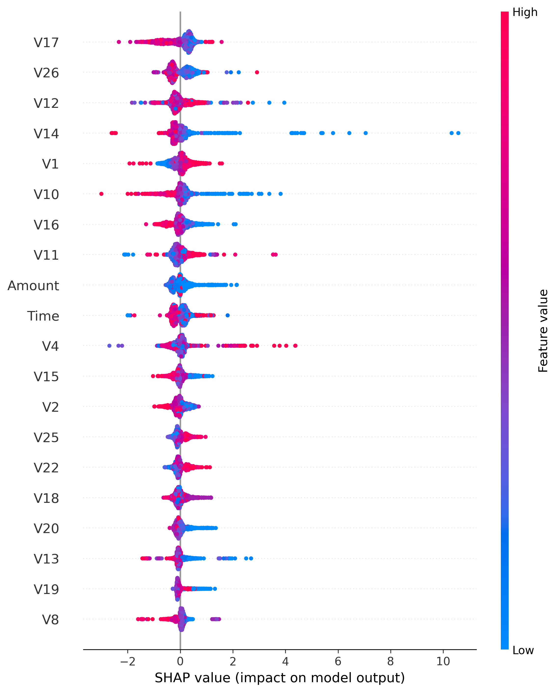

# Fraud Detection System – Model Monitoring Report

## 1. Model Evaluation (Test Set)

**Results**

- ROC-AUC: **0.9655**
- PR-AUC: **0.8385**
- Fraud Recall: **83.78%**
- False Positive Rate: **0.00042**

**Confusion Matrix**

| Outcome | Count |
|---|---|
| True Positives | 62 |
| False Positives | 18 |
| False Negatives | 12 |
| True Negatives | 42630 |

**Interpretation**

The model correctly detected **62 fraudulent transactions** while missing **12 fraud cases**.  
Out of more than **42,000 legitimate transactions**, only **18 were incorrectly flagged**.

**Business Impact**

- Fraud detection coverage: **83.78%**
- Legitimate transaction approval rate: **~99.96%**
- Minimal customer disruption while capturing most fraud attempts.

---

## 2. Utility Optimisation

**Optimal Threshold:** `0.002004`

| Metric | Value |
|---|---|
| Fraud Recall | 83.78% |
| Approval Rate | 99.8127% |
| False Positive Rate | 0.00129 |
| Estimated Utility | **£5965** |

**Interpretation**

Instead of optimizing generic accuracy, the decision threshold was tuned to **maximize financial utility** while maintaining strict fraud-risk constraints.

**Business Impact**

- Maintains strong fraud detection
- Preserves customer experience
- Generates an estimated **£5965 economic value improvement**

---

## 3. Recall Stability Across Time Windows

| Window | Recall | FPR |
|---|---|---|
| Window_1 | 0.9718 | 0.000239 |
| Window_2 | 0.9239 | 0.000056 |
| Window_3 | 0.9690 | 0.000225 |
| Window_4 | 0.9149 | 0.000127 |

**Interpretation**

The baseline recall of **97.18%** in Window 1 decreases in subsequent windows.  
Window 2 and Window 4 show noticeable drops.

**Business Impact**

This suggests that fraud patterns are evolving over time and require **continuous monitoring and model governance**.

---

## 4. Data Drift Detection

| Window | KL Divergence |
|---|---|
| Window_1 | 0.000 |
| Window_2 | **15.138** |
| Window_3 | 2.556 |
| Window_4 | 3.874 |

**Interpretation**

Window 2 exhibits a **large divergence from the baseline distribution**, indicating substantial behavioural changes in transaction patterns.

**Business Impact**

Such shifts may represent:

- new fraud strategies
- changing customer behaviour
- evolving transaction patterns

Monitoring these changes prevents fraud models from becoming outdated.

---

## 5. Drift Governance Decision

| Window | Recall | KL Divergence | Drift Alert |
|---|---|---|---|
| Window_1 | 0.9718 | 0.0 | False |
| Window_2 | 0.9239 | 15.138 | **True** |
| Window_3 | 0.9690 | 2.556 | False |
| Window_4 | 0.9149 | 3.874 | **True** |

**Retraining Recommendation**

Drift detected in **Window 2** and **Window 4**.

**Interpretation**

When both conditions occur:

- distribution shift (KL divergence)
- recall degradation

the governance policy triggers **model retraining**.

**Business Impact**

This ensures the fraud detection system **adapts automatically to changing fraud behaviour**.

---

## 6. Model Explainability

**Interpretation**

The SHAP analysis shows how each feature contributes to the fraud prediction decision.

Key observations:

- Fraud predictions are strongly influenced by **behavioural transaction features** (PCA-derived `V` variables).
- The model does **not rely solely on transaction amount**, indicating it captures complex behavioural patterns.

**Business Impact**

Explainability enables:

- regulatory transparency
- fraud analyst interpretability
- auditability of automated decisions.

---

## 7. System Architecture

The deployed system integrates:

1. **LightGBM fraud prediction engine**
2. **Utility-optimized decision threshold**
3. **Drift monitoring with KL divergence**
4. **Retraining governance rules**
5. **Real-time API scoring**

This transforms the project from a static ML model into a **production-ready fraud detection lifecycle system**.

---

## 8. Real-Time Scoring API

The API receives transaction features and returns:

- fraud probability
- decision classification

This demonstrates how the model can integrate with **payment systems or banking transaction pipelines**.

**Business Impact**

- Enables real-time fraud risk scoring
- Supports automated blocking or manual review workflows
- Provides scalable integration for digital banking systems